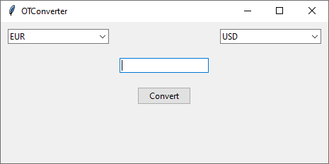
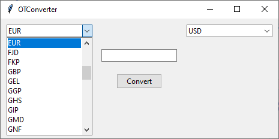
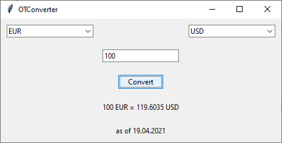

# **OTConverter**

Sovellus on valuutanvaihtolaskuri. Se käyttää [exhangerate.host](https://exchangerate.host/#/) API:tä selvittääkseen valuuttakurssit reaaliajassa. Sovelluksessa on 170 eri maan valuuttaa sekä Bitcoin.


## Miten sovellus toimii?

Asenna riippuvuudet:
```bash
poetry install
```

Käynnistä sovellus:
```bash
poetry run invoke start
```

Sovelluksen alkunäkymä:



Valitse useista valuutoista:



Ja vaihda valuuttasi:




### Sovelluksen testaus

```bash
poetry run invoke test
```


### Sovelluksen testikattavuus

```bash
poetry run invoke coverage-report
```


### Pylint-tarkastelu

```bash
poetry run invoke lint
```


#### Projektin Python versio: 3.6


### Linkit työhön:

* [Linkki vaativuusmäärittelyyn](https://github.com/Sanexi/ot-harjoitustyo/blob/master/dokumentaatio/vaatimusmaarittely.md)
* [Linkki työaikakirjanpitoon](https://github.com/Sanexi/ot-harjoitustyo/blob/master/dokumentaatio/tyoaikakirjanpito.md)
* [Linkki arkkitehtuuriin](https://github.com/Sanexi/ot-harjoitustyo/blob/master/dokumentaatio/arkkitehtuuri.md)


