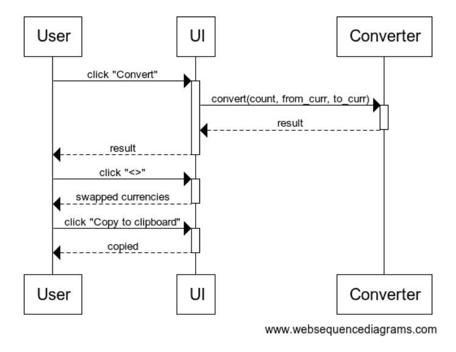

# Sovelluksen arkkitehtuuri

## Käyttöliittymä

Sovelluksen käyttöliittyymässä on yksi näkymä, joka muuttuu käyttäjän antamien arvojen perusteella näyttämään käännetyn valuutan arvon. Käyttöliittymässä on myös mahdollista kopioida helposti valuuttamuuntimen tulos, sekä vaihtaa muunnettavien valuuttojen paikaa.

## Rakenne

Sovelluksen rakenne on hyvin yksinkertainen niinkuin sovelluksen pakkauskaaviosta näkyy:

[UI -hakemisto](https://github.com/Sanexi/ot-harjoitustyo/tree/master/src/ui) sisältää sovelluksen käyttöliittymän koodin ja [Converter -hakemisto](https://github.com/Sanexi/ot-harjoitustyo/tree/master/src/converter) sisältää itse valuuttamuuntimen koodin, sekä API:n toiminnan. [Index](https://github.com/Sanexi/ot-harjoitustyo/blob/master/src/index.py) käynnistää sovelluksen käyttöliittymän.

## Sovelluslogiikka

Sovelluksen logiikka tulee pitkälti ilmi pakkauskaaviosta. 
Kaikki käyttöliittymän elementit tulevat luokkien [Converter](https://github.com/Sanexi/ot-harjoitustyo/blob/master/src/converter/converter.py#L23) ja [ExhangeRateApi](https://github.com/Sanexi/ot-harjoitustyo/blob/master/src/converter/converter.py#L5) metodeista

Converter:
- `convert(count, from_curr, to_curr)` - Vaihtaa valuutan
- `date()` - Antaa valuutanvaihdon ajankohdan

ExhangeRateApi:
- `get_rates()` - Antaa mahdolliset valuutat

## Sovelluksen toiminnallisuus

Sekvenssikaavio kuvaa sovelluksen ominaisuudet: valuutanvaihdon, leikepöydälle kopioimisen, sekä vaihdettavien valuuttojen paikan muuttamisen.

