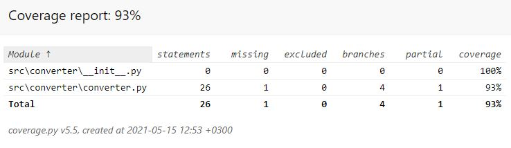

# Sovelluksen testaaminen

Sovelluksen testaus tapahtuu automaattisesti [unittestillä](https://docs.python.org/3/library/unittest.html).

## Testauksen toimivuus
Sovelluksen pääluokkaa testaa tiedosto [converter_test.py](https://github.com/Sanexi/ot-harjoitustyo/blob/master/src/tests/converter_test.py), jossa on sovelluksen kaikki testit.
Testitiedostossa on testiluokka TestConverter sekä StubExchangeRateApi, joka luo testausta varten erillisen valuutanvaihtimen, jotta valuutanvaihdon tulosta voidaan testata.

## Sovelluksen testikattavuus
Sovellus on hyvin yksinkertainen ja sovelluksen testikattavuus on noin 93%



## Testin suorittaminen
#### Testin voi suorittaa myös itse kun sovellus on toimintakunnossa käyttämällä komentoa

```
poetry run invoke test
```

#### Sovelluksen testikattavuuden saa näkyviin kommennolla

```
poetry run invoke coverage
```

#### Sovelluksen testikattavuutta voi tarkastella myös selaimessa ajamalla komennon
```
poetry run invoke coverage-report
```
ja avaamalla sovelluksen htmlcov-hakemiston index.html tiedoston
