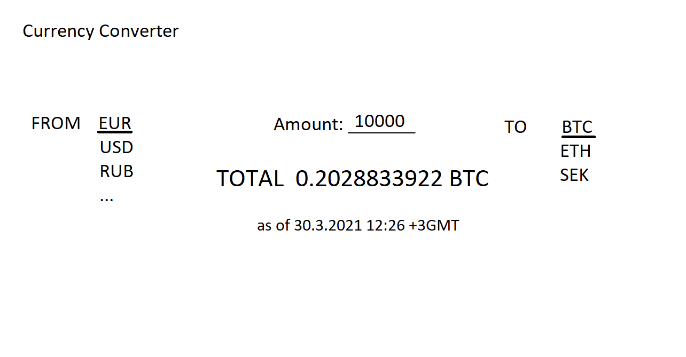

# Vaativuusmäärittely

## Sovelluksen kuvaus
Sovellus on valuutanvaihtolaskuri. Siinä on helposti käytettävä käyttöliittymä, jossa on mahdollista tarkastaa monien valuuttojen kurssit hyvin nopeasti, mukaan lukien suosituimmat virtuaalivaluutat. Sovelluksessa ei ole käyttäjiä. Se hakee valuuttakurssit API:n avulla.

## Esimerkkikuva käyttöliittymästä

