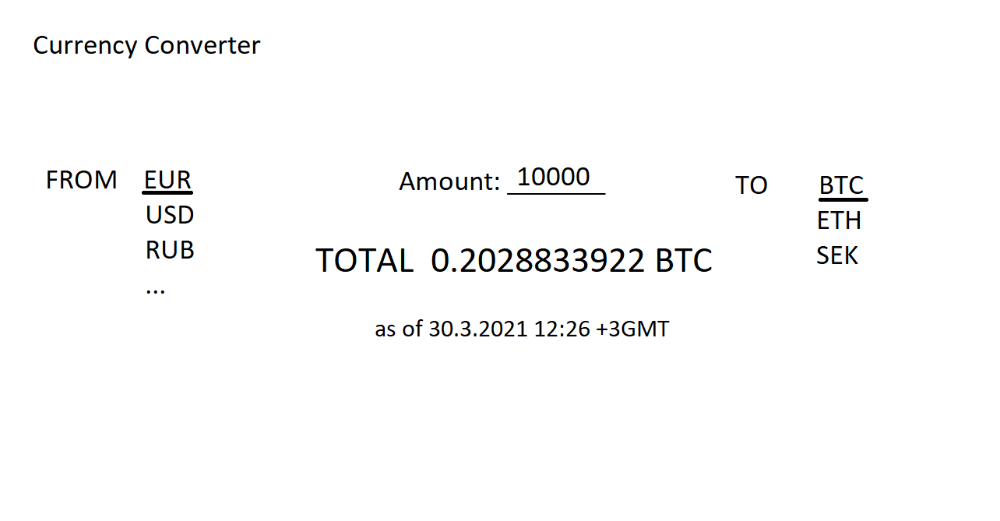

# Vaativuusmäärittely

## Sovelluksen kuvaus
Sovellus on valuutanvaihtolaskuri. Siinä on helposti käytettävä käyttöliittymä, jossa on mahdollista tarkastaa monien valuuttojen kurssit hyvin nopeasti, mukaan lukien suosituimmat virtuaalivaluutat. Sovelluksessa ei ole käyttäjiä. Se hakee valuuttakurssit API:n avulla.

## Esimerkkikuva käyttöliittymästä

Sovelluksessa yksi näkymä, jossa voi valita valuutan mistä kääntää, sekä mihin kääntää ja tuloksena on käännetty valuuttamäärä, sekä kurssien päivämäärä.

## Perusversion toiminnallisuus
* Käyttäjä voi valita valuutan, josta haluaa kääntää - tehty viikko 5
* Käyttäjä voi valita valuutan, johon hän haluaa kääntää - tehty viikko 5
* Käyttäjä saa käännetyn valuuttamäärän syötettyään haluamansa arvon - tehty viikko 5
* Käyttäjä näkee kuinka uusi kurssi on käytössä - tehty viikko 5
* Käyttäjä ei pysty syöttämään virheellistä tietoa - tehty viikko 6

## Mahdolliset kehitysideat
* Käyttäjä voi syöttää valuuttamäärän leikepöydältä painamalla yhtä näppäintä
* Käyttäjä voi kopioida leikepöydälle saamansa valuuttamäärän painamalla yhtä näppäintä - tehty viikko 5
* Sovellus muistaa käyttäjän usein käytetyt valuutat ja suosittelee näitä
* Sovellus näyttää eniten käännetyt valuutat ensimmäisenä
* Tietokanta kiinnostavista tiedoista kuten kuinka monta kertaa tiettyä valuuttaa ollaan käännetty
* Enemmän käännettäviä valuuttoja - tehty viikko 5
* Valuutoille symbolit/liput
* Käyttäjäystävällisempi käyttöliittymä - tehty viikko 6
* Käyttäjä voi vaihtaa kahden valuutan vaihtosuuntaa nopeasti - tehty viikko 5
